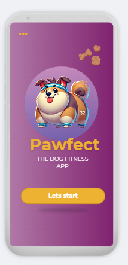
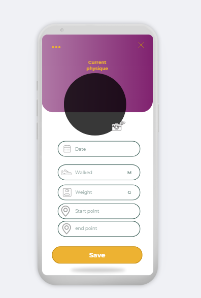
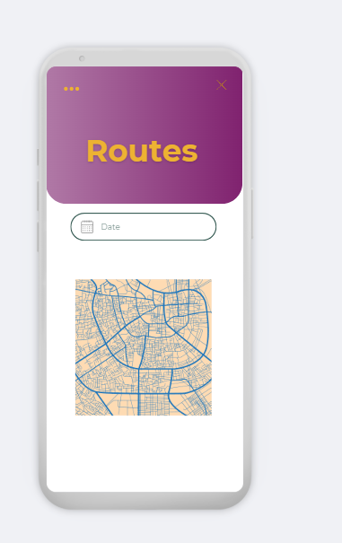
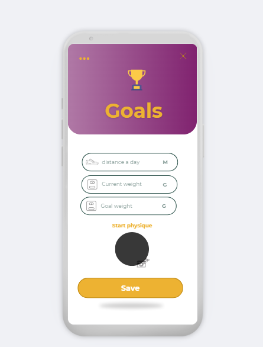
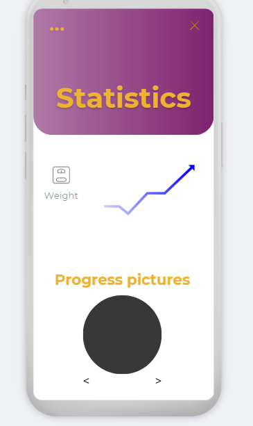

# Permanente evaluatie

**Vul hieronder verder aan zoals beschreven in de [projectopgave](https://javascript.pit-graduaten.be/evaluatie/mobile/pe.html).**

Bewegingsapp voor Huisdieren
Een fitness- en tracking-app voor huisdieren.

## Scherm 0

home page

## Scherm 1

Dagboek: Dynamische pagina waar bewegingen of activiteiten van het huisdier worden bijgehouden, inclusief fotos.

## Scherm 2

Kaart: Bekijk routes die met het huisdier zijn gelopen.

## Scherm 3

Doelen: Stel gezondheidsdoelen in, zoals stappen of speeltijd.

## Scherm 4

Rapporten: Overzicht van behaalde doelen en trends.

## Native modules
Native modules:
Geolocation: Routes bijhouden tijdens een wandeling.
Notifications: Herinneringen voor beweging.

## Online services

Online services:
Google Maps API: Routeoverzicht.
Firebase Authentication: Gebruikersbeheer.
Cloud Firestore: Activiteitenlogboek opslaan.

opmerking: Voorlopig wordt het geprogrammeerd zodat mensen stappen en/of km kunnen ingeven in plaats van het tracken van de geolocatie. Dit zou een extra nice to have feature zijn. 

## Gestures & animaties

gesture: Afbeelding terug laten verkleinen op de dagboek pagina

animatie: op de rapport pagina, gaat de statistiek zichtbaar omhoog. 

# Feedback

**Wordt verder aangevuld door jouw docent.**

